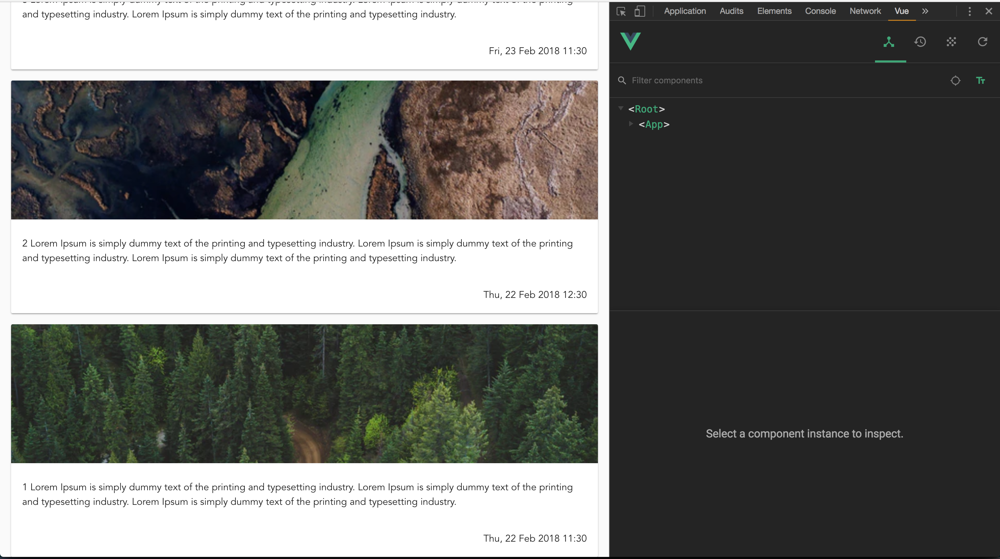

Assignment 4 - Splitting into components
========================================

Task 4.1
--------

We don't want all code in one single component. Adding components and using them is really simple.

In your previous exercise you ended up with a template in the List.vue looking something like this:
```
<template>
  <v-container fluid grid-list-lg>
    <v-layout row wrap>
      <v-flex v-for="feed in feeds" :key="feed.id" xs12 md6 offset-md3>
        <v-card>
          <v-card-media :src="feed.image" height="200" />
          <v-card-title primary-title class="text-xs-left">{{ feed.text }}</v-card-title>
        </v-card>
      </v-flex>
    </v-layout>
  </v-container>
</template>
```

Now, this is all well and good, but as the cards increase in complexity this will obviously result in code that is 
difficult to maintain.

From the code above you can see that `v-flex` and `v-card` etc. are all components that we can use. Your task is to
create your own component that you call `ListItem.vue` which includes a template for the `v-card` and take properties 
supplied from `List.vue`.

Hint: Take a look on the [guide on how to create components](https://vuejs.org/v2/guide/components.html).

Task 4.2
--------

When we have our ListItem component we can import this into our List component.

We do this by adding an `import ListItem from './ListItem.vue';` statement to the top of our `<script>` tag.

Next you must register the component locally (it is not practical to register them globally). You do this by adding them
to the `components` property:

```
<script>
import ListItem from './ListItem';

export default {
  name: 'List',
  components: { ListItem },
  computed: {
    ...
  }
};
</script>
```


Task 4.3
--------

Having made our own component, we also want to include third party components.

For this assignment we are going to use the `datetime` value in our feed items and display these timestamps in an
understandable format, i.e. `1519381800` converted to `Fri, 23 Feb 2018 11:30`. This is simply too complex to do
yourself, so we will rely on a package called `moment`.

First you need to install `moment` using npm like you did with `vuetify` in the previous assignment.

Second you need to import it into the `ListItem.vue` component.

Moment is not difficult to use or learn, but we won't spend time learning that package here. You need to create a 
[computed property](https://vuejs.org/v2/guide/computed.html#Basic-Example) that returns this:

```
return moment.unix(this.datetime).format('ddd, DD MMM YYYY HH:mm');
```

Now use this property in your `ListItem.vue` template to finish this task.

The result should look something like this: 


Bonus tasks
===========

Bonus 4.1
---------

Create your own `listitem-datetime-sorter` utility in a `utils` folder inside src. General utilities can be placed here.
In this case is is a sorter function that looks like this:

```
export default (e1, e2) => e2.datetime - e1.datetime;
```

Import this function as you would `import` any other component and use this on the list in the `feeds` property in 
`List.vue`.
