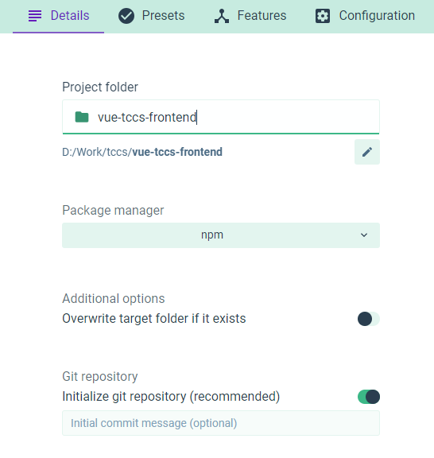
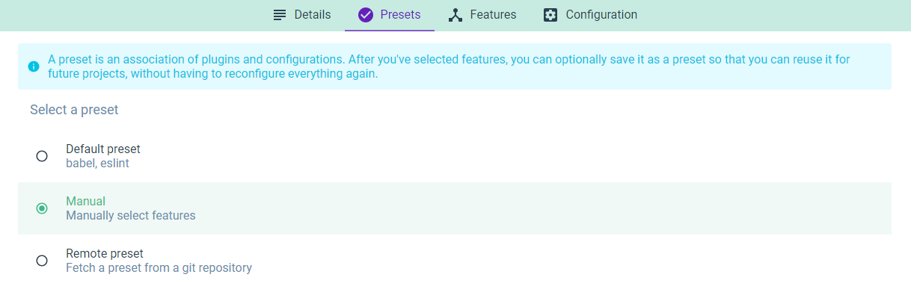
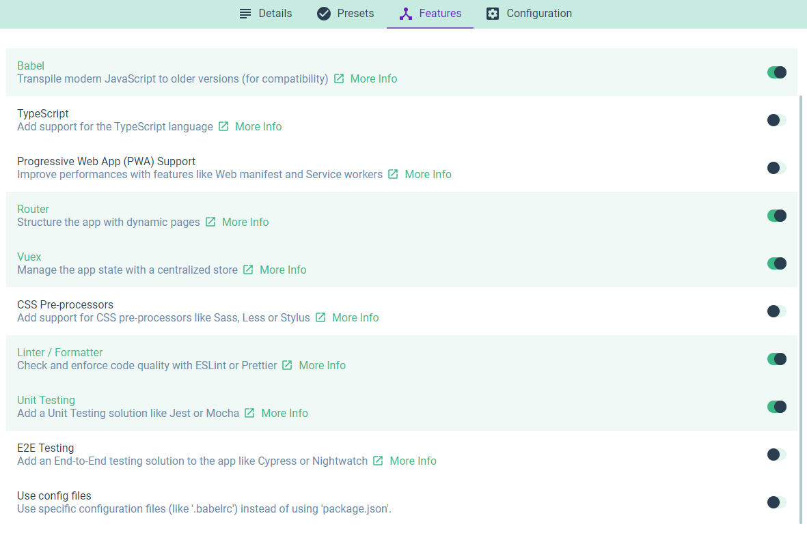
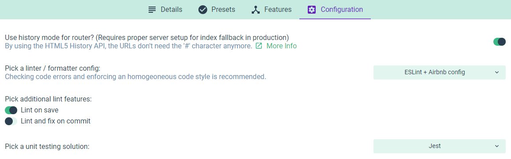

Assignment 2 - Boiler plate
===========================

Task 2.1
--------

First we need to install a few more tools. We need the command line tool vue-cli. We install this using npm from your prompt:

```
> npm install -g @vue/cli
```

This installs the vue-cli globally for your computer. It should not be part of your project so don't forget the -g parameter.

Make sure your Vue CLI is properly installed and accessible with

```
> vue
```

or

```
> vue -V
```


Task 2.2
--------

The next task is to initialize the project. Type

```
> vue
```

to get available options for this tool. As you can see, cli 3 includes a new, fancy UI. Let's try this one.

```
> vue ui
```

Which will present you with a browser based UI that you can use to create new, as well as manage existing, Vue projects. Now, let's create our project.



Click "Next" and select "Manual". This will let us select what features to include in the project.



Click "Next" and select features like we have done below.



Click "Next" and configure the project like we have done below.



Click "Create Project" (choose yourself whether to save our config as a preset or not).

Please feel free to explore your project by opening it in your IDE.

Task 2.3
--------

Last but not least we want to see that this project runs on our computer. The project has been created with several build `scripts` that can be found in your `package.json` file.

```
"scripts": {
    "serve": "vue-cli-service serve",
    "build": "vue-cli-service build",
    "lint": "vue-cli-service lint",
    "test:unit": "vue-cli-service test:unit"
  }
```

In order to start your project locally, just run:

```
> npm run serve
```

This will start a local web server and a watcher that monitors your project for changes. Open Chrome and the URL given by the web server. You should see the Hello World page.

> You can also access all these tasks, including some other snack, using the Vue UI tool that we just used to create the project. Feel free to explore its features yourself!

Task 2.4
--------

When you created your project, you configured something called "Linting". This is a beatiful tool that statically analyzes your code to discover prolems. It also helps a team to keep the codestyle within a project consistant. As well as discovering your errors it can even fix some of them for you. 

We can configure ESLint anyway we want by creating our own rules, but usually we go with a preconfigured rule set. In this project we chose a Vue-adapted ESLint config based on the well renowned Airbnb Javascript Style Guide.

Now, try to add an "error" to your code. You can for instance go to `Home.vue` and replace the single quotes (`'`) in the import statement with doble quotes (`"`). If you're using IntelliJ, you should now see a red underline. You can fix it (directly in IntelliJ) by placing your cursor in the marked error, pressing `alt + enter` and selecting `ESLint: Fix 'quotes'`.

Add the same "error" again, but this time you run 
```
> npm run lint
```

Cool, eh?

The Airbnb style guide enforces a maximum line length of 100 characters. Let's increase this to 120 by changing that specific rule. Go to `package.json` and add the following
```
...
"eslintConfig": {
    ...
    "rules": {
      "max-len": ["error", { "code": 120 }]
    },
    ...
}
...
```
You can see all available rules at [https://eslint.org/docs/rules/](https://eslint.org/docs/rules/).
