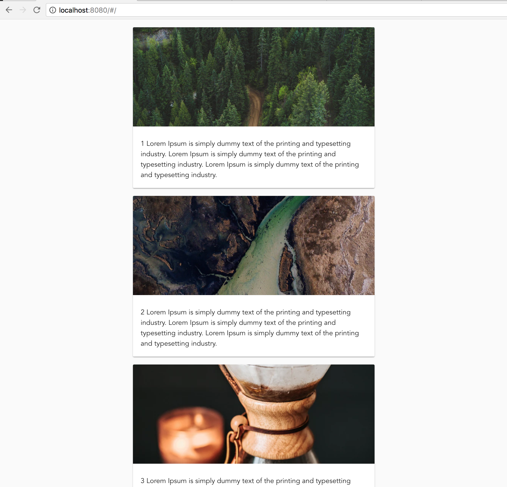

Assignment 3 - Your first vue component
=======================================

Task 3.1
--------

The last thing we want to do is use a lot of precious time to develop a GUI from scratch. So the first thing we will do
(ka-ching) is to install [Vuetify](https://vuetifyjs.com/en/). Vuetify is a GUI toolkit that mimics Material Design 
(Google's design framework for mobile devices). In order to add this to our project we simply use npm:

```
> npm install --save vuetify
```

You can now check that your package.json includes vuetify as a dependency.


Task 3.2
--------

The next step is to activate vuetify in your project. Open your main.js file in the src folder. You will see that the
imports are as follows:

```
import Vue from 'vue'
import App from './App'
import router from './router'

...
```

Add an import for Vuetify like this (right after Vue, before App):

```
import Vuetify from 'vuetify'
import 'vuetify/dist/vuetify.min.css';
```

> Notice that components are, as a rule, written with capital letter.

Next we need to tell Vue to use Vuetify as a plugin:

```
Vue.use(Vuetify)
```


Task 3.3
--------

We want to remove the `HelloWorld.vue` component, which was generated by the vue-cli, and create our own. But we need
to follow a few steps first.

1. Create a sub-folder in components called `feed` and create the file `List.vue` there. You may copy the content from 
`HelloWorld.vue` and strip out all the contents of `template`, `script` and `style` tags.

    > Notice that we want to put components in sub-folders to avoid cluttering the components folder. As the project
    grows, some folders will naturally grow. To be able to keep our sanity we want to group files that belong together 
    in designated folders.

2. In the `src/router/index.js` file you will find the router setup for your project. Notice that `HelloWorld.vue` is
imported and referenced there. Replace both the import and the route definition for the route `/` with the new
`List.vue` component.

3. Add some dummy HTML (`<h1>Howdy!</h1>`) in the `List.vue` template section and check that this is displayed correctly
in Chrome.


Task 3.4
--------

Let's use Vuetify to create something! We will start simple.

The `List.vue` component will list a few cards with dummy images and text. Fill in the `script` tag with 
the following:

```
<script>
export default {
  name: 'List',
  computed: {
    feeds() {
      return [
        {
          id: 1,
          image: 'https://images.unsplash.com/photo-1520716497194-0bde97ce9abe?ixlib=rb-0.3.5&ixid=eyJhcHBfaWQiOjEyMDd9&s=c8936d0802da9d0b3554637661201471&auto=format&fit=crop&w=701&q=80',
          text: '1 Lorem Ipsum is simply dummy text of the printing and typesetting industry. Lorem Ipsum is simply dummy text of the printing and typesetting industry. Lorem Ipsum is simply dummy text of the printing and typesetting industry.',
          datetime: 1519295400,
        },
        {
          id: 2,
          image: 'https://images.unsplash.com/photo-1520704103437-2b033fcfa64f?ixlib=rb-0.3.5&ixid=eyJhcHBfaWQiOjEyMDd9&s=595bd894ef85d6c8fbbb24e210635710&auto=format&fit=crop&w=564&q=80',
          text: '2 Lorem Ipsum is simply dummy text of the printing and typesetting industry. Lorem Ipsum is simply dummy text of the printing and typesetting industry. Lorem Ipsum is simply dummy text of the printing and typesetting industry.',
          datetime: 1519299000,
        },
        {
          id: 3,
          image: 'https://images.unsplash.com/photo-1520722217742-5887a8cb5778?ixlib=rb-0.3.5&ixid=eyJhcHBfaWQiOjEyMDd9&s=6e82e7e3dd060b43c1301238185b12b5&auto=format&fit=crop&w=634&q=80',
          text: '3 Lorem Ipsum is simply dummy text of the printing and typesetting industry. Lorem Ipsum is simply dummy text of the printing and typesetting industry. Lorem Ipsum is simply dummy text of the printing and typesetting industry.',
          datetime: 1519381800,
        },
      ];
    },
  },
};
</script>
```

This will provide you with data that you can display in the template.

Then we need to create a template that displays the list. The finished page should look like this:


Since Vue and Vuetify is probably new to you, we will help you along on this first task. If you'd rather
figure out stuff yourself, take a look at the [Cards documentation](https://vuetifyjs.com/en/components/cards) for
inspiration.

**Spoiler alert!** Below follows a detailed description of all steps to create our template.

Read about [the grid system](https://vuetifyjs.com/en/layout/grid) in the documentation.

The default setup for a vuetify page is:

```
<template>
  <v-container>
    <v-layout>
      <v-flex>
      </v-flex>
    </v-layout>
  </v-container>
</template
```

To the `v-container` we add `fluid` to make the content fill the page width, and `grid-list-{xs|sm|md|lg|xl}` to specify space 
between components within the `v-layout`.

In `v-layout` we specify that the content can `wrap` when exceeding the 12 flexible columns.

Let's say we want the `v-flex` elements to behave differently for smaller devices we can use the `{xs|sm|md|lg|xl}{1-12}`
size specifications and `offset-{xs|sm|md|lg|xl}{1-12}` to [adjust the layout based on device width](https://vuetifyjs.com/en/layout/display).
If we want the layout to display a center adjusted `v-flex` for medium sized devices and up we can add `md6 offset-md3`.
For small devices we want it to fill out the entire 12 columns (100%) and specify `xs12`.

```
<template>
  <v-container fluid grid-list-lg>
    <v-layout wrap>
      <v-flex xs12 md6 offset-md3>
      </v-flex>
    </v-layout>
  </v-container>
</template
```

So, we're missing the content. Add a `v-card`.

```
<template>
  <v-container fluid grid-list-lg>
    <v-layout row wrap>
      <v-flex v-for="feed in feeds" :key="feed.id" xs12 md6 offset-md3>
        <v-card >
          <v-card-media :src="feed.image" height="200" />
          <v-card-title primary-title class="text-xs-left">{{ feed.text }}</v-card-title>
        </v-card>
      </v-flex>
    </v-layout>
  </v-container>
</template
```


Bonus tasks
===========

Bonus 3.1
---------

As a bonus task you can add your own theme to your project. First [read the manual](https://vuetifyjs.com/en/style/theme)
and then set up a theme in the Vuetify options.
