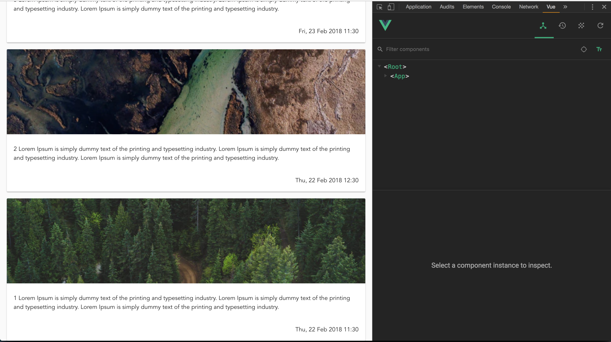

Assignment 4 - Splitting into components
========================================

Task 4.1
--------

We don't want all code in one single component. Adding components and using them is really simple.

In your previous exercise you ended up with a template in the List.vue looking something like this:
```
<template>
  <v-container fluid>
    <v-row class="flex-column" align="center">
      <v-col cols="6" xl="4" v-for="item in feed" :key="item.id">
        <v-card >
          <v-img :src="item.image" height="200px"/>
          <v-card-text>{{ item.text }}</v-card-text>
        </v-card>
      </v-col>
    </v-row>
  </v-container>
</template>
```

Now, this is all well and good, but as the cards increase in complexity this will obviously result in code that is difficult to maintain.

From the code above you can see that `v-col` and `v-card` etc. are all components that we can use. Your task is to create your own component that you call `ListItem.vue` which includes a template for the `v-card` and take properties supplied from `List.vue`.

Hint: Take a look on the [guide on how to create components](https://vuejs.org/v2/guide/components.html#Passing-Data-to-Child-Components-with-Props)
We want you to use the [single `.vue` file approach to creating a component](https://vuejs.org/v2/guide/single-file-components.html).

Task 4.2
--------

When we have our `ListItem` component we can import this into our `List` component (just like you did in [Task 3.3](../assignment-3/README.md)).


Task 4.3
--------

Having made our own component, we also want to include third party components.

For this assignment we are going to use the `datetime` value in our feed items and display these timestamps in an understandable format, i.e. `1519381800` converted to `Fri, 23 Feb 2018, 11:30`. This is simply too complex to do yourself, so we will rely on a package called `i18n`. This is almost a de facto standard for handling information that depends on user region or language in the Javascript world. In this case we'll only use it for formating the date string, but in a production application we'd use it for any text, numbers, amounts, dates, currencies, etc. that is being displayed to the user. This makes e.g. translating a page to a different language a walk in the park. 

It's perhaps a bit overkill to use it for this simple task, but we really want you to know about i18n in case you'll need it in the future (and trust me, you will...).

Since we're using vue, we'll use an i18n plugin made specifically for Vue. 

First you need to install `vue-i18n` using npm: 
```
> npm add vue-i18n
```

This is a [Vue plugin](https://vuejs.org/v2/guide/plugins.html). Plugins can be registered locally (i.e. in single components) or globally. We'll register this one globally so that it's available in all our components. Do this by adding 
    
```
import VueI18n from 'vue-i18n';

Vue.use(VueI18n);
```
to your `main.js` file. Next we'll configure it. To save you some google searches, we'll provide the required configuration: 
```
//main.js

const i18n = new VueI18n({
  locale: 'en-GB',
  dateTimeFormats: {
    'en-GB': {
      long: {
        weekday: 'short',
        year: 'numeric',
        month: 'short',
        day: 'numeric',
        hour: 'numeric',
        minute: 'numeric',
      },
    },
  },
});

new Vue({
  router,
  store,
  vuetify,
  i18n,
  render: (h) => h(App),
}).$mount('#app');;
```

Now you need to create a [computed property](https://vuejs.org/v2/guide/computed.html#Basic-Example) that returns this:

```
return this.$d(this.timestamp * 1000, 'long');
```

in your `ListItem.vue` template to finish this task.

> PS1: In the context of a component, `this` references that component, while the `$` prefix is a naming convention for "public instance properties" – i.e. stuff that is globally available through the Vue instance object. 

> PS2: We're multiplying by 1000 because in the Javascript world, timestamps are (almost) always expected to be in milliseconds.

The result should look something like this: 



Bonus tasks
===========

Bonus 4.1
---------

Create your own `listItemDatetimeSorter` utility in a `utils` folder inside src. General utilities can be placed here.
In this case is is a sorter function that looks like this:

```
export default (e1, e2) => e|.datetime - e2.datetime;
```

Import this function as you would `import` any other component and use this on the list in the `feeds` property in 
`List.vue`. Hint: Make a computed property that depends on the feed in the data property.

Bonus 4.2
---------

You didn't really need to create your own computed property to achieve what we did in task 4.3. Try using the plugin (`$d()`) directly in the template instead.

Bonus 4.3
---------

Use [this example](https://vuetifyjs.com/en/components/grids/#examples) as inspiration to create another layout for `List.vue` using grid instead of a simple list. Play around with Vuetify a bit and discover the ease and beauty of it.

Bonus 4.4
---------

Try changing the date format to Danish. You can find the docs for vue-i18n [here](https://kazupon.github.io/vue-i18n/guide/datetime.html). Hint: The ISO 639-1 language code is `da`.
