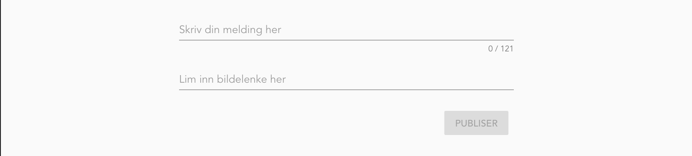
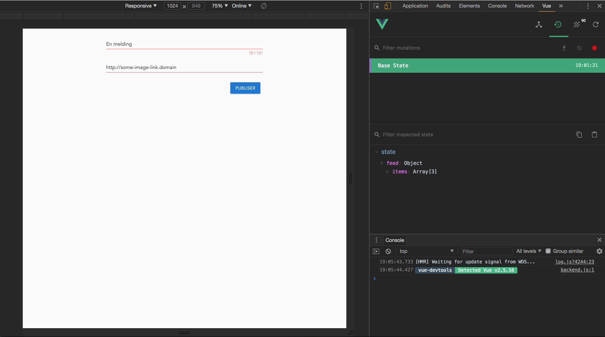
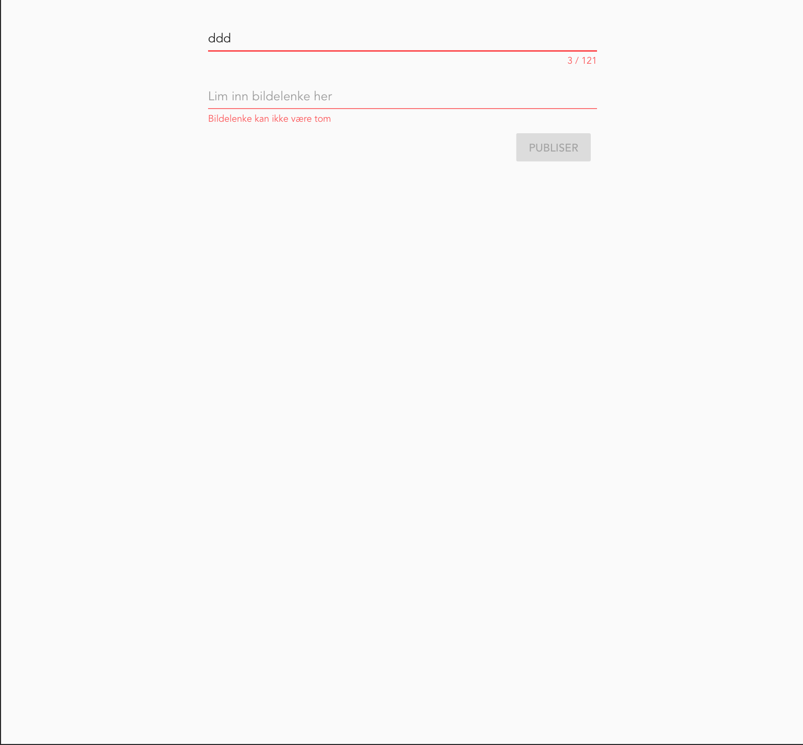

Assignment 5 - Store it!
========================

Task 5.1 - Store
--------

The project is growing and we need to be able to handle larger amounts of data in the frontend application. We do this
by using what's called a **store**.

The store holds a **state** for the application. In this first task we want to move our data into a store, and we'll see
about changing the state of the store later.

In our `List.vue` component we have hard coded `feeds()` as a list of items that we display. However, this list may
change as items are added, changed or removed.

We need to move this data into a store. In Vue.js the store is handled by Vuex. So first we need to install the `vuex`
component using `npm` on the command line.

Then you need to create a `store/index.js` in your `src` folder. It should like something like this:

```
import Vue from 'vue';
import Vuex from 'vuex';

Vue.use(Vuex);

const store = new Vuex.Store({
  state: {}, // initial state
});

export default store;
```

In the `state` object we can add things we want to be available in the store as a default. Now move the list of items
from `List.vue` into the state here. Beware that is should not be a function like in the `computed` property of the 
components.

To enable have this `store/index.js` being run with the web page we need to add it to the `Vue` configuration.

In the `main.js` file, just import the store and add it to the configuration object in `new Vue()`.

Lastly we need to use the state in our `List.vue` object instead of the hardcoded list. Wrap the `computed` object
with the `mapState()` function that you can import from `vuex` like this:

```
import { mapState } from 'vuex'; 
```

You can now access the state in the `computed` functions like this:

```
computed: mapState({
    feeds: state => state.feed.items,
})
```
Please feel free to harden this code (there is no guarantee that the `state.feed.items` are defined) and also add the
sorting from previous assignment.

Check that the web page looks exactly like it did before adding the store.


Task 5.2 - Mutations
--------

Now that we have the store up and running, we want to add functionality to modify it. In Vue this is called **mutating**
the state. In React/Redux we call them reducers, but in Vue they are called `mutations`. They are very similar.

The `mutations` are added directly to the `Vuex.Store()` configuration object and contain a map of functions, where the
key is the name or identifier of the mutation, and the value is a function which takes the `state` and a `payload` as 
parameters.

```
const store = new Vue.Store({
    state: {}, // initial state
    mutations: allMyMutations // imported from somewhere else
});
```

So a mutation function quite simply modifies the `state` with what is in the payload. It's a function so you can also 
add a lot of magic here if you like. However, it's probably best to keep the mutations simple.

**Beware** that you should **NOT** modify the content of the state directly, but rather replace it. For instance if you
are adding an item to a list, you should make a new list and join the items in the old one with the new item. This can 
be done simply like this:

```
newList = [...oldList, item];
```
This ["spreads"](https://developer.mozilla.org/en-US/docs/Web/JavaScript/Reference/Operators/Spread_syntax) the old list
and joins the items in it with the new item.

Let's create our first mutation. Create the directory `src/store/mutations`. We will add in `index.js` file here to join
all our mutations in. This will look something like this:

```
import myFirstMutations from './myFirstMutations';

export default {
    ...myFirstMutations
}
```

`myFirstMutations` would then contain something like this:

```
export const MY_MUTATION_ID = 'MY_MUTATION_ID';

export default {
    [MY_MUTATION_ID](state, payload) {
        state.items = [...state.items, payload]
    }
}
```
Of course you can add as many mutations you like here, but you should organize the mutations properly and group them by
component or similar.

Create your own mutation that adds an item the the list of feed items that you have in your state.
Import the `mutations/index` module to the store.


Task 5.3 - Forms
--------

In order to mutate the state, we need a form where the user can add new cards to the list.

First we create a new Vue-component `components/feed/CreateListItem.vue`. In the `router/index.js` you will make this 
the front page for now (i.e. create a new route with `path: '/'` and `CreateListItem` as the component)
and change the path for the `List` component to `path: '/list'`.

In the `CreateListItem` component we start by building the template. We need to build this step by step so that it is 
understandable. The simplest of forms, which we will use as a starting point, can be something like this:

```
<v-form>
    <v-text-field
        v-model="message"
    />
    <v-btn
        @click="submit"
        color="primary"
    >
        {{ submitButtonText }}
    </v-btn>
</v-form>
```

Notice that we bind the data property `message` to the the text field with `v-model` and that clicking on the button
calls the method `submit`. We need to add a default message value and `submit()` property to our Vue component:

```
export default {
    name: 'CreateListItem',
    data() {
        return {
            message: '',
            submitButtonText: 'Publisér',
        };
    },
    methods: {
        submit() {
            // TODO submit data
        }
    }
}
```

Now use what you have learned about Vuetify using `v-container` and `v-flex` and so on to create something like this:



Hint: Take a look at the [Form documentation in Vuetify](https://vuetifyjs.com/en/components/forms) to get some
inspiration.

Task 5.4 - Submitting
--------

So the form looks good, and we have our basic form structure in the component. Next we need to actually couple the submit
with the mutation we create earlier.

We need to import `mapMutations` from `vuex` and the mutation identifier we created in task 5.2.

```
import { mapMutations } from 'vuex';
import { ADD_FEED_ITEM } from '../../store/mutations/feed';
```

We use `mapMutations` for mapping our mutation(s) into our local `methods` object:

```
    methods: {
        ...mapMutations([ ADD_FEED_ITEM ]),
        submit() {
            // TODO submit data
        }
    }
```

This create a local reference to `ADD_FEED_ITEM` in our methods object.
Then we can call this mutation from the `submit()` function as it is available in `this`, which refers to the component
object:

```
    methods: {
        ...mapMutations([ ADD_FEED_ITEM ]),
        submit() {
            this.ADD_FEED_ITEM({
                id: Math.floor(Math.random() * 10000),
                text: this.message,
                image: this.imageUrl,
                datetime: moment().unix(),
            });
        }
    }
```

Now put all this together. You should have all you need to complete the task, but you may find that there are some
holes that need to be filled along the way...

In the end, when everything works, you can test [this in the browser](http://localhost:8080). Open the application and 
then open your inspector in Chrome. Navigate to your Vue plugin and specifically the Vuex state:



Fill in the form and press your submit button and notice that the state changes:


You can also navigate your browser to [`http://localhost:8080/#/list`]() to see that the list has changed! Cool, right?


Bonus tasks
===========

Bonus 5.1
---------

Dumb forms that accept anything is a dangerous thing, and we don't want that. We should avoid cross site scripting,
faulty data, etc.

Your task, should you choose to accept it, is to add validation to the form. There are several ways to do this. Again, 
take a look at the [Form documentation in Vuetify](https://vuetifyjs.com/en/components/forms) to get some inspiration.

I would recommend, if time permits, to try both creating your own validation as described in the link above and also 
using third party tools like `vuelidate`.

You need to add validation that the message is no longer than a max length, and that both fields are required. Feel free to
add more validation if you see the need.


