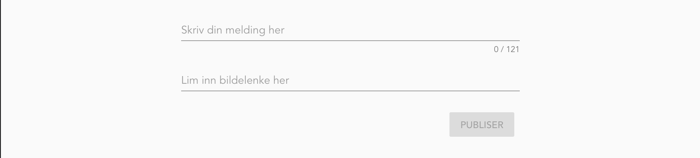
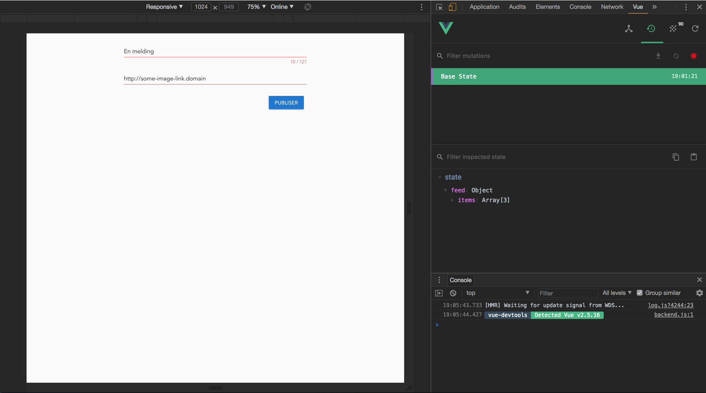
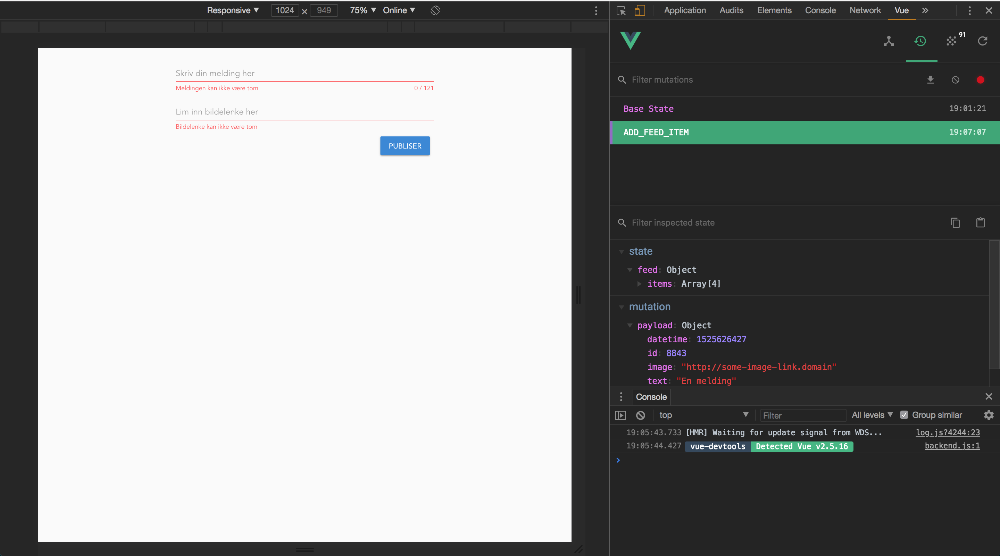
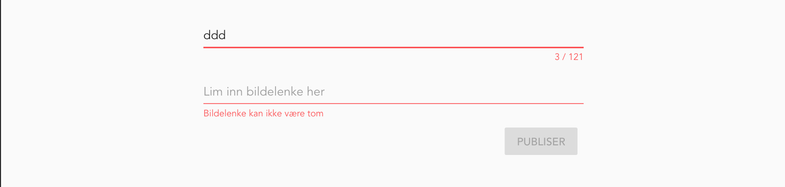

Assignment 6 - Store it!
========================

Task 6.1 - Store
--------

The project is growing and we need to be able to handle larger amounts of data in the frontend application. We do this by using what's called a **store**.

The store holds a **state** for the application. In this first task we want to move our data into a store, and we'll see about changing the state of the store later.

In our `List.vue` component we have hard coded `feed()` as a list of items that we display. However, this list may change as items are added, changed or removed.

We need to move this data into a store. In Vue.js the store is handled by Vuex. At this point we usually would have installed the `vuex` component by using `npm` on the command line. Luckily, we already included it when we initialized the project, so we're all good.

You should find `store/index.js` in your `src` folder. It should like something like this:

```
import Vue from 'vue';
import Vuex from 'vuex';

Vue.use(Vuex);

export default new Vuex.Store({
  state: {
  },
  mutations: {
  },
  actions: {
  },
  modules: {
  },
```
> You could add your mutations, actions, modules and inital states directly in this file, but you shouldn't. For an app of some size, you will end up with a lot of each type, so for readability and scalability, it's best to put them in separate files and import them into `router/index.js` instead.

If you take a look at your `main.js` file, you should see that this module is imported and added to your Vue instance. This is everything it takes for Vuex to be available in your application.

In the `state` object we can add things we want to be available in the store as a default. Now move the list of items from `List.vue` into the state here. Beware that it should not be a function like in the `data` property of the components.

Lastly we need to use the state in our `List.vue` object instead of the hardcoded list. Wrap the `computed` object with the `mapState()` function that you can import from `vuex` like this:

```
import { mapState } from 'vuex'; 
```

You can create a function to expose the state in the `computed` functions like this:

```
computed: {
    ...mapState(['feed']),
})
```
Make sure that the sorting from the previous assignment still works.

Check that the web page looks exactly like it did before adding the store.


Task 6.2 - Mutations
--------

Now that we have the store up and running, we want to add functionality to modify it. In Vue this is called **mutating** the state. In React/Redux we call them reducers, but in Vue they are called `mutations`. They are very similar.

The `mutations` are added directly to the `Vuex.Store()` configuration object and contain a map of functions, where the key is the name or identifier of the mutation, and the value is a function which takes the `state` and a `payload` as parameters.

```
const store = new Vue.Store({
    state: {}, // initial state
    mutations: allMyMutations // imported from somewhere else
});
```

So a mutation function quite simply modifies the `state` with what is in the payload. It's a function, so you can also add a lot of magic here if you like (...but you really shouldn't.)

**Beware** that you should **NOT** modify the content of the state directly, but rather replace it. For instance if you are adding an item to a list, you should make a new list and join the items in the old one with the new item. This can be done quite simply in JS, like this:

```
newList = [...oldList, item];
```
This ["spreads"](https://developer.mozilla.org/en-US/docs/Web/JavaScript/Reference/Operators/Spread_syntax) the old list and joins the items in it with the new item. Cool, eh?

Let's create our first mutation. Create the directory `src/store/mutations`. We will add an `index.js` file here to join all our mutations. This will look something like this:

```
// store/mutations/index.js

import myFirstMutations from './myFirstMutations';

export default {
    ...myFirstMutations
}
```

`myFirstMutations` would then contain something like this:

```
// store/mutations/myMyFirstMutations.js

export const MY_MUTATION_ID = 'MY_MUTATION_ID';

export default {
    [MY_MUTATION_ID](state, payload) {
        state.feed = [...state.feed, payload]
    }
}
```
You can add as many mutations you like here, but you should organize the mutations properly and group them by components or similar.

Create your own mutation that adds an item the list of feed items that you have in your state. Import the `mutations/index` module to the store (`store/index.js`) and add it to the `mutations` object.

Task 6.3 - Actions
--------
You are free to modify the state directly from your components, but this is considered bad practice, and you **should not** do it. As your application grows, doing so will almost certainly cause trouble sooner or later. This is why we have `actions`. Trigger actions from your components, and let the actions commit the mutations.

Unlike mutations, actions do not take state as a parameter. Instead, they take the whole store object as the 1st parameter. This store object contains a `commit` method that we use for committing mutations. The 2nd parameter is optional, and can be used for "payload". Beside this, we can create actions following the exact same pattern that we did for mutations: 

1. Create the directory `store/actions`
1. Put all your actions in there.
1. Create a `store/index.js` file where all actions are joined.
1. Import `store/actions/index.js` in `store/index.js` and add it to its `actions` property.

Create an action takes a new feed item and commits the mutation you created in 6.2.

Example:
```
import { MY_MUTATION_ID } from '@/store/mutations/myFirstMutations';

export const MY_ACTION = 'myAction';

export default {
  [MY_ACTION]({ commit }, newItem) {
    commit(MY_MUTATION_ID, newItem);
  },
};
```
> In this example we use destructuring to extract only the `commit` method from the store object passed to the action method.

Task 6.4 - Forms
--------

In order to mutate the state, we need a form where the user can add new cards to the list. First, let's make a new view to put it in.

Use what you've learned so far to
1. Create a new `AddItemView` component in `views`
1. Add a new route `/add` in your router and point it to the new view component.
1. Create a new component `/components/feed/AddFeedItem`.
1. (Optional) Add a way to navigate to this new view (perhaps an "ADD ITEM" button on the feed page?). If you don't do this, you have to manually input the path to your view every time (PS. Manually changing the url in the browser will reload your single-page application, causing the state to reset every time you do it...)


In the `CreateListItem` component we start by building the template. We need to build this step by step so that it is understandable. The simplest of forms, which we will use as a starting point, can be something like this:

```
<v-form>
 <v-text-field v-model="message"/>
 <v-btn @click="submit">
  Publish
 </v-btn>
</v-form>
```

Notice that we bind the data property `message` to the text field with `v-model` and that clicking on the button calls the method `submit`. We need to add a default message value and `submit()` property to our Vue component:

```
export default {
    name: 'CreateListItem',
    data() {
        return {
            message: '',
        };
    },
    methods: {
        submit() {
            // TODO submit data
        }
    }
}
```

Now use what you have learned about Vuetify using `v-container`, `v-row` and `v-col` to create something like this:



Hint: Perhaps you can reuse some layout from `List.vue`?

Hint: Take a look at the [Form documentation in Vuetify](https://vuetifyjs.com/en/components/forms) to get some
inspiration.

Task 6.5 - Submitting
--------

So the form looks good, and we have our basic form structure in the component. Next we need to actually make the submit button put a new item in our store. To do this, we will use the action we created above.

We need to import `mapAction` from `vuex` and the action name we created in task 6.3.

```
import { mapMutations } from 'vuex';
import { ADD_FEED_ITEM } from '@/store/actions';
```

We use `mapActions` for mapping our action(s) into our local `methods` object:

```
methods: {
  ...mapActions([SUBMIT_ITEM]),
  submit() {
    // TODO submit data
  },
},
```

This creates a local reference to `SUBMIT_ITEM` in our methods object.
Then we can call this mutation from the `submit()` function as it is available in `this`, which refers to the component object:

```
methods: {
  ...mapActions([SUBMIT_ITEM]),
  submit() {
    this[SUBMIT_ITEM](
      {
        id: Math.floor(Math.random() * 10000),
        text: this.message,
        image: this.imageUrl,
        datetime: (new Date()).getTime() / 1000,
      },
    );
  },
},
```

Now put all this together. You should have all you need to complete the task, but you may find that there are some holes that need to be filled along the way...

In the end, when everything works, you can test [this in the browser](http://localhost:8080). Open the application and 
then open your inspector in Chrome. Navigate to your Vue plugin and specifically the Vuex state:



Fill in the form and press your submit button and notice that the state changes:



You can also add a link to the list view to se the result. Just add the following somewhere in your page: 

```
<router-link :to="{name: 'Feed'}">See list</router-link>
```

Bonus tasks
===========

Bonus 6.1
---------

Dumb forms that accept anything is a dangerous thing, and we don't want that. We should avoid cross site scripting, faulty data, etc.

Your task, should you choose to accept it, is to add validation to the form. There are several ways to do this. Again, take a look at the [Form documentation in Vuetify](https://vuetifyjs.com/en/components/forms) to get some inspiration.

I would recommend, if time permits, to try both creating your own validation as described in the link above and also using third party tools like `vuelidate`.

You need to add validation that the message is no longer than a max length, and that both fields are required. Feel free to add more validation if you see the need.


