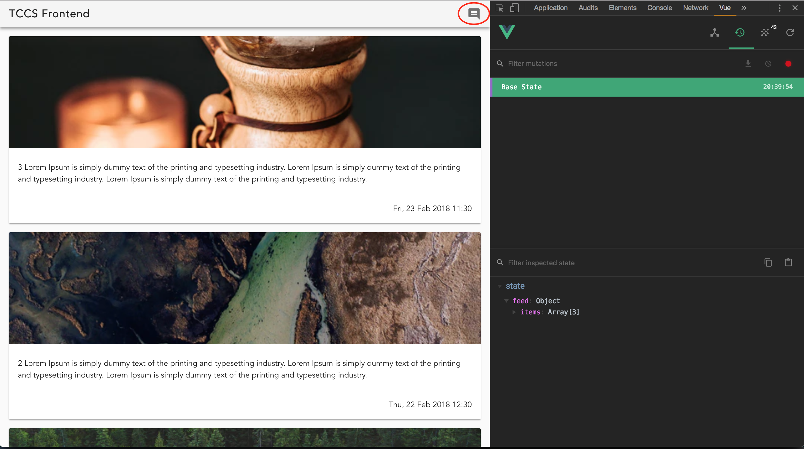
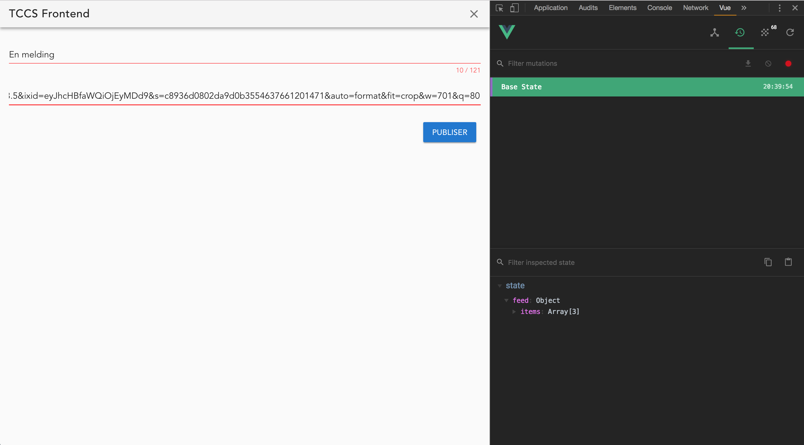
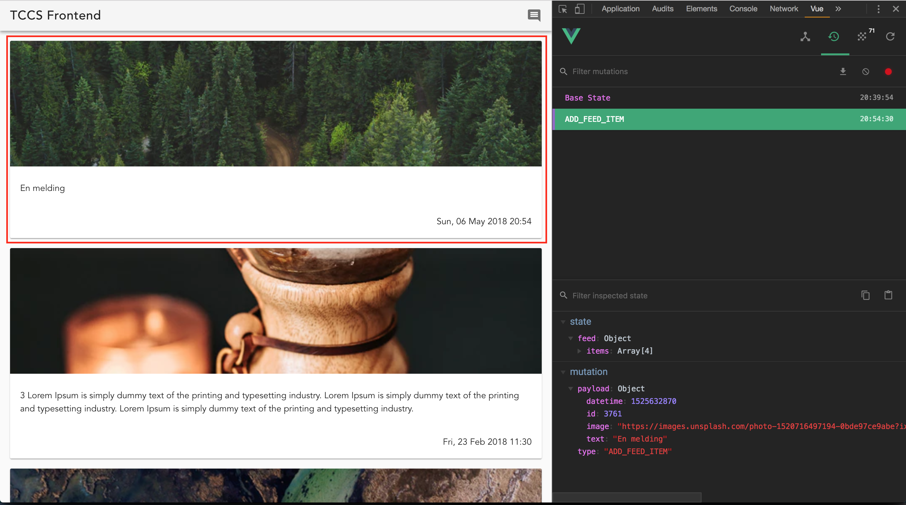

Assignment 6 - Toolbar and navigation
=====================================

Task 6.1 - Your own Toolbar
--------

Using the `v-toolbar` in Vuetify is all good, and we will do that, but we want to create our own `Toolbar` component
that we can use on different pages and avoid repeating common template elements on all pages.

So go ahead and create the file `components/common/Toolbar.vue` and will in the template with:

```
<template>
  <v-toolbar>
    <v-toolbar-title>{{ title }}</v-toolbar-title>
    <v-spacer />
    <v-toolbar-items>
      <v-icon class="toolbar-icon" @click="onClick">
        {{ icon }}
      </v-icon>
    </v-toolbar-items>
  </v-toolbar>
</template>
```

This is supposed to be a common component, so we don't supply the data for `title` and `icon` directly in this component.
No, we need to add some properties to our component that can be set from outside. [Read about passing data from parent 
 to child components here](https://vuejs.org/v2/guide/components.html#Passing-Data-to-Child-Components-with-Props).
 
Add props for `title` and `icon` to your `Toolbar` component.

You also need to add the `onClick` function to the local `methods` object, and we'll look at what goes in the function 
shortly.

Before we proceed you need to add the icons to the web page. We import these from `fonts.googleapis.com` by adding this
line in the `index.html` somewhere in the `<head></head>`tag:

```
<link href='https://fonts.googleapis.com/css?family=Roboto:300,400,500,700|Material+Icons' rel="stylesheet">
```


Task 6.2 - Add the Toolbar to your pages
--------

We have two main routes in our project; `/list` and `/`. First change these routes so that the `List` component is 
accessed from the route `/` and make `CreateListItem` available on the route `/create-list-item`. The previous switch
was only temporary anyway.

In `List.vue` and `CreateListItem.vue` import the `Toolbar` component and add it to the top of the templates (you may 
need to surround two elements in the template with a `<div>...</div>` so that there is only *one* top element.)

You also need to provide a `title` and `icon` for the toolbars. Use the icon `comment` on the `List.vue` toolbar and 
`clear` in the `CreateListItem.vue` component.




Task 6.3 - Routing around
--------

Nothing is more sad than buttons that do nothing. Let's make these Toolbar buttons do something.

In the Toolbar we created we have just one button, which is fine for now. In the Toolbar component re don't care what
icon it displays and more importantly what the button does. We want the parent component to handle that. This is a very
important concept when creating common components.

So how to call a method in the parent component from the `onClick` method that we have? We `$emit` something from the child.
This can then be handled in the parent. [Read about it here](https://vuejs.org/v2/guide/components.html#Emitting-a-Value-With-an-Event).

Again, we don't care what the parent does with the information that the button was clicked, we just say that it was:

```
  methods: {
    onClick() {
      this.$emit('toolbar-icon-click');
    },
  },
```

We're just saying that the event `toolbar-icon-click` has been triggered.

Next we need to handle this differently in `List.vue` and `CreateListItem.vue`. The first wants to navigate to
`/create-list-item` and the other wants to exit the create form. Same button, different use. No problem!

Create a `v-on:...` handler in the Toolbar implementations in the templates and create the method
```
    goToFeedPage() {
      this.$router.push({ name: 'List' });
    },
```
in `CreateListItem` and the method
```
    goToCreateListItemPage() {
      this.$router.push({ name: 'CreateListItem' });
    },
```
in the `List` component.

Congratulations, we can navigate!

Task 6.4 - Navigate after submit
--------

One piece is missing, and that is to navigate back to `List` when the form is validated and submitted, and the state has
changed to include the new item. Given what you've learned this should be easy to implement now.



The results after submit should then be that you see your new item in the list as soon as you publish your item:


