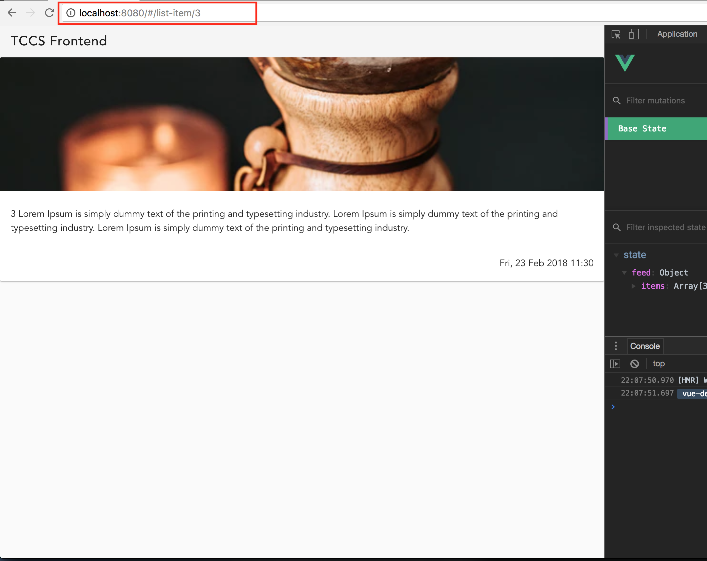
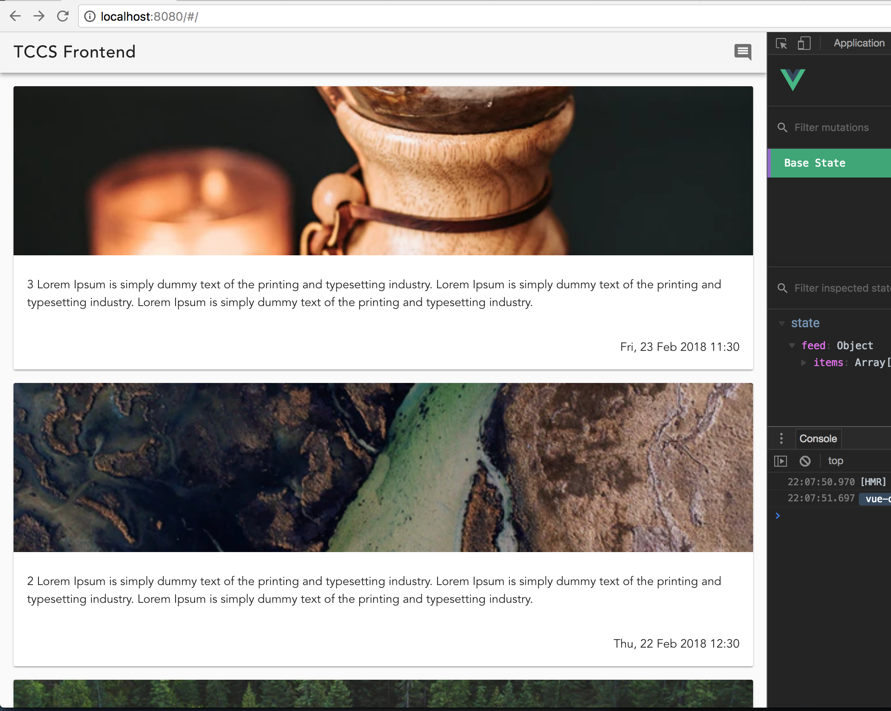

Assignment 7 - More navigation
==============================

Task 7.1 - Link home
--------

In Assignment 6 we added a toolbar and introduced some navigation between pages. Now we want to expand on that.
The first simple thing we can add to the `Toolbar.vue` component is a link home. We want to set the toolbar title to
link to the front page of the application.

For the `toolbar-icon` we used the `@click` property and a handler method to emit an event to the parent. For this case
we can assume that clicking the page title should always return you to the home page.

We can simply use the `router-link` component defined in `vue-router`. Look up the [documentation for router-link](https://router.vuejs.org/api/#router-link)
and add a link to the home route in `Toolbar.vue`. To avoid the ugly styling of the default a-tag (albeit the proper
HTML tag) you should use `tag="div"` or similar.

You can now test that clicking the toolbar title in the `http://localhost:8080/#/create-list-item` page will essentially
do the same as pressing the toolbar icon.


Task 7.2 - Dynamic URL in route
--------

In our application we want to open a full view of any item in the list when we click on them. For simplicity we will just
display the same card in the list as in on the full view.

First we just duplicate `ListItem.vue` and call it `ListItemCard.vue`. Remember to change the `name` in the `script` tag.

In `ListItem.vue` we now replace the template content with the `<ListItemCard ... />`:

```
<template>
  <ListItemCard
    :image="image"
    :text="text"
    :datetime="datetime"
  />
</template>
```

You should also clean up the rest of the code and remove code that is no longer relevant in the `ListItem` component.

Next we create a new component to be our full screen view of the item. Create the file `components/feed/ViewListItem.vue`.

Before providing content to this file we will add a route to access it. The path may include parameters that we can access from the component on run time. You specify what is a parameter in the route by prefixing it with a `:`. 

Create a route for `ViewListItem` with the path `/list-item/:id`. 
`/list-item/:id` is called a dynamic URL because it can change but still refer to the same route and be handled by the same component. You should also add `props: true` to the new route, to indicate that the params from the URL should be passed on as props to the component.

The template in `ViewListItem` is very similar to the one in `ListItem.vue`, but you should add a new prop: `id`. You must also add a `Toolbar` on top (icon is not needed). You can access values in an object from the template directly, for instance `:image="item.image"`.

Next we need to use `mapState` to access the items in the state and find the current item based on the id provided as a prop. Here is the finished computed property for the `item` that can be used in the template:

```
  computed: mapState({
    item(state) {
      const items = state.feed.items;
      if (!items || !Array.isArray(items)) {
        return {};
      }
      
      return state.feed.items.find(item => item.id.toString() === this.id.toString()) || {};
    },
  }),
```

Finish the template and test the route `http://localhost:8080/#/list-item/3`. This should be the result:



Task 7.3 - Link to a dynamic route
--------

We need to round this up with the actual link from `ListItem.vue` to `ViewListItem`. In the template we surround the 
`ListItemCard` with a `router-link`. We could either link using the path `list-item/` concatenated with the id of the 
item to get something like `:to="list-item/3"`, but a clearer code would be to use an object specifying the name of
the route and an object of params to go with it:

```
  <router-link tag="div" :to="{ name: 'ViewListItem', params: { id }}">
    <ListItemCard ... />
  </router-link>
```

Where do we get the `id` from? We add it as a prop to `ListItem.vue` and provide that prop in `List.vue`. That's it!



Test that clicking on the items in the list directs you to the full page view of the item you clicked. You can also test
that you can add items and click on these new items in the list as well.


Bonus tasks
===========

Bonus 7.1
---------

There is another way to use Vuetify components with `router-link` that will make task 7.3 even simpler. Can you figure
it out by reading the [Cards documentation](https://vuetifyjs.com/en/components/cards)?
